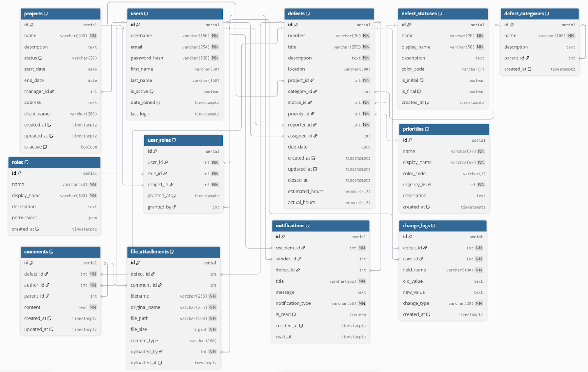

# Система управления дефектами проектов (TRP Control System)
Веб-приложение для управления дефектами в проектах с возможностью создания, отслеживания и контроля устранения выявленных неполадок. Система обеспечивает полный цикл работы: от регистрации дефекта и назначения исполнителя до контроля статусов и формирования отчётности для руководства.

> ### Использованные технологии
> Frontend:
> [](https://www.npmjs.com/)
> [](https://nextjs.org/)
> [](https://reactjs.org/)
> [](https://www.typescriptlang.org/)
> [](https://tailwindcss.com/)
> <br/>Backend: 
> [](https://www.python.org/)
> [](https://fastapi.tiangolo.com/)
> [](https://www.sqlalchemy.org/)
> [](https://www.postgresql.org/)
> [](https://redis.io/)
> <br/>Infrastructure: 
> [](https://www.docker.com/)
> [](https://nginx.org/)
---

## Функционал
1. Регистрация пользователей и аутентификация.
2. Разграничение прав доступа посредством привилегий.
3. Управление проектами/объектами и их этапами.
4. Создание и редактирование дефектов (заголовок, описание, приоритет, исполнитель, сроки, вложения).
5. Хранение и управление статусами дефектов: Новая → В работе → На проверке → Закрыта/Отменена.
6. Ведение истории изменений дефектов.
7. Поиск, сортировка и фильтрация дефектов.
8. Экспорт отчётности в CSV/Excel.
9. Просмотр аналитических отчётов (графики, статистика).
10. Система комментариев и уведомлений о критических событиях.

 
## Основные роли
 1. **Инженеры**: Регистрация/исправление дефектов, обновление информации о дефектах, добавление и редактирование объектов.
 2. **Менеджеры**: Назначение задач по исправлению дефектов, формирование отчетов.
 3. **Руководители и заказчики**: Просмотр прогресса, отчетности.

## Use Case диаграммы


## Архитектура стеков
[Frontend часть](./frontend/README.md)


## Архитектура базы данных


## Структура проекта

```
TRP_Clean/
├── backend/          # FastAPI приложение
├── frontend/         # Next.js приложение
├── docker/           # Docker конфигурации
├── docs/             # Документация проекта
├── database/         # Схемы и миграции БД
└── images/           # Диаграммы и изображения
```

## Требования к системе

- Python 3.11+
- Node.js 18+
- PostgreSQL 15+
- Redis 6+
- Docker & Docker Compose

## Установка и запуск

### Разработка

1. Клонировать репозиторий
2. Скопировать и настроить переменные окружения из `.env.example`
3. Запустить через Docker Compose:

```bash
docker-compose -f docker-compose.dev.yml up
```

### Продакшн

```bash
docker-compose up -d
```

## Страницы
1. **Страница авторизации**
   Форма входа с полями email и пароль, возможность регистрации новых пользователей.
2. **Страница проектов/объектов**
   Список проектов и объектов с возможностью создания новых. Форма для добавления проекта/объекта.
3. **Страница дефектов**
   Список дефектов с возможностью фильтрации по объектам, статусам, ответственным, срокам. Форма для добавления нового дефекта.
4. **Страница дефекта**
   Подробная информация о дефекте с фотографиями. Возможность редактирования дефекта при наличии привилегий. Просмотр истории изменений.
5. **Страница аналитики**
   Диаграммы и статистика по дефектам с возможностью фильтрации по датам, объектам и ответственным. Экспорт отчетов в CSV/Excel.

## API

API документация доступна по адресу: `http://localhost:8000/docs`
